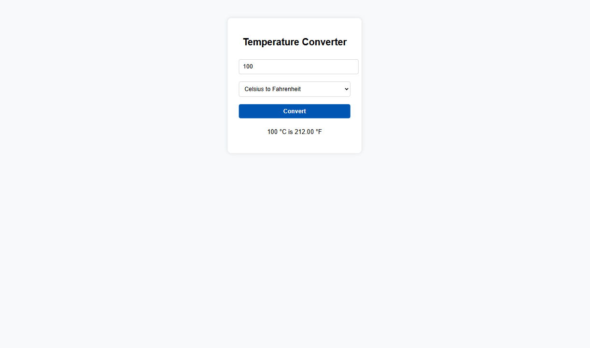
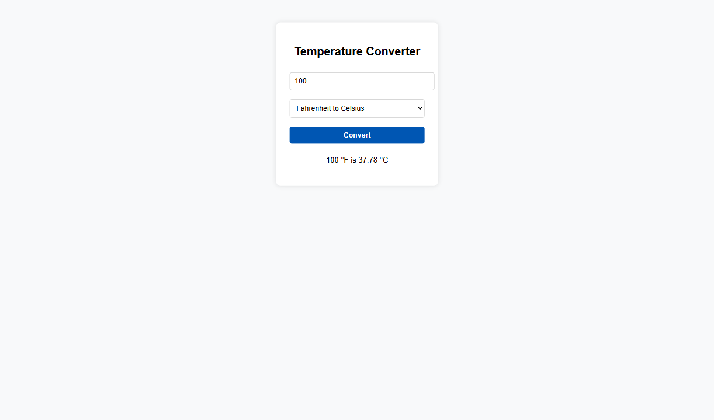

# Temperature Converter

This is a web-based temperature converter application that allows users to convert temperatures between Celsius and Fahrenheit. It is implemented using HTML, CSS, and JavaScript.

## Requirements

### HTML Structure and JavaScript Functionality
The application has a simple layout with the following elements:
- Input fields for entering temperatures and a drop-down menu for selecting the unit of temperature.
- A 'Convert' button for triggering the temperature conversion.
- Display areas to show the converted temperatures and any error messages.

The layout of the application resembles the figure below:

### Example Use Cases

The following screenshots demonstrate the temperature conversion functionality:

- 
  Convert 100°C to Fahrenheit.

- 
  Convert 100°F to Celsius.

### Dynamic Behavior
The application uses event listeners to capture user actions (button clicks) dynamically. It triggers the temperature conversion functions and displays the converted temperatures in real time.

### Control Structures
The application uses control structures (if statements) to validate input. It ensures that the input is numeric and performs the correct conversion based on the user's selection. It displays appropriate error messages for invalid input.

## Implementation

The application is implemented in the following files:
- [index.html](Temprature%20converter/index.html)
- [style.css](Temprature%20converter/style.css)
- [script.js](Temprature%20converter/script.js)

## Usage

To use the application, open the [index.html](Temprature%20converter/index.html), [style.css](Temprature%20converter/style.css), and [script.js](Temprature%20converter/script.js) files in a web browser. Enter the temperature in the input field and select the unit of temperature. Click the 'Convert' button to see the converted temperature.

